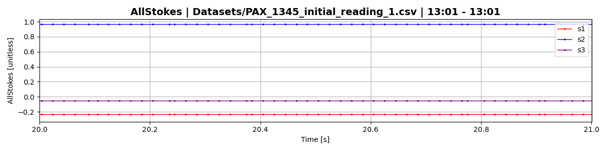

# Visualizing ThorLABS polarimeter measurement rate

## Introduction
The THORLABS PAX1000 digital polarimeter is a rotating wave plate based polarimeter with a nominal measurement rate up to 400 Hz when using a supplementary power supply. While many would like to use this product for precise and consistent measurement of time-varying polarization signals, the PAX1000 unfortunately fails expectations in both measurement rate and, more importantly, rate consistency.

Many signal processing applications like noise quantification and signal stability analysis benefit from (if not require) evenly spaced points and high measurement rate to obtain accurate and useful results. The [Allan Deviation](https://en.wikipedia.org/wiki/Allan_variance) metric, for example, provides much less reliable noise quantification information when its input data points are not evenly spaced in time; I was only able to make use of this metric after understanding the measurement rate of the datasets I was taking.

This repository contains code I wrote to easily quantify and visualize the PAX's measurement rate (or more acurately, the time difference between points (tdbp)). It helped me to understand the quality and utility of my datasets, and may be of further use for others wishing to do the same.

TODO: Include picture of PAX

## Measurement rate variability
Ideally, the PAX1000 should take measurements evenly spaced in time - if the measurement rate is 20Hz, it should take a measurement every 0.05 seconds. Especially for higher measurement rates on the PAX (>80Hz), this "time difference between points" (TDBP) does not live up to expectations, and is furthermore widely varying throughout a given run.

### Example 1
Below is an example of poor behavior in a typical polarization dataset. I measured the output of a 10mW, 1345nm telecom laser at a nominal rate of 200Hz for 120 seconds. Shown is an arbitrary 1 second segment of the normalized [Stokes parameters](https://en.wikipedia.org/wiki/Stokes_parameters) that were recorded.

Notice the uneven spacing between data points. Calculating the time difference between each measurement in the whole dataset and plotting these values on a histogram, we can see how the distribution of these time differences compares to the nominal tdbp value of 0.005 seconds, marked in red. The average tdbp of the actual distribution is marked in blue, and the standard deviation in purple. It is plotted both on a linear and log-scale y-axis.

Keep in mind that the log scaling in the second plot emphasizes uncommon occurrences, like the large gaps beyond 0.04 seconds.

### Example 2
Here is another dataset taken minutes before example 1. The only difference is that the nominal measurement rate has been quartered from 200Hz to 50Hz. Even though the average tdbp now reaches the nominal value, there is still a wide spread in the values, and large gaps many times the average tdbp.

Interestingly, we sometimes obtain spacing between points that is less than the nominal value (faster than expected), but larger gaps balance them out to keep the average tdbp at the nominal value. This suggests that the PAX software that records timestamped measurements may have trouble managing resources, occasinally slowing down or speeding up based on computational intensity (note: this problem persists on both PAX1000 polarimeters I have access to, on two laptops and one desktop running the software, with no other programs running and the PAX software priority set to very high).

## Code
These visualization tools can be interacted with in the [jupyter notebook](PAX_Code_Notebook.ipynb).

The Dataset class contains all relevant code for cleaning and visualizing the .csv file output from the PAX1000 software. Initializing a Dataset instance with the path to your file will automatically read in the data and relevant parameters from the run. A few example datasets including the ones displayed above are provided.

The method "Dataset.rate_hist()" will plot a histogram of the tdbp for the entire dataset; you can plot this histogram with a log-scale or linear-scale y-axis and with greater or fewer bins depending on the number of measurements you have access to. The method "Dataset.plot()" allows you to view the the measured parameters over the entirety or during any segment of the run. See the notebook for further details.

### Obtaining .csv file from PAX software
This code relies on the dataset comming from the PAX1000 software.

TODO: Pictures, guide for getting dataset
