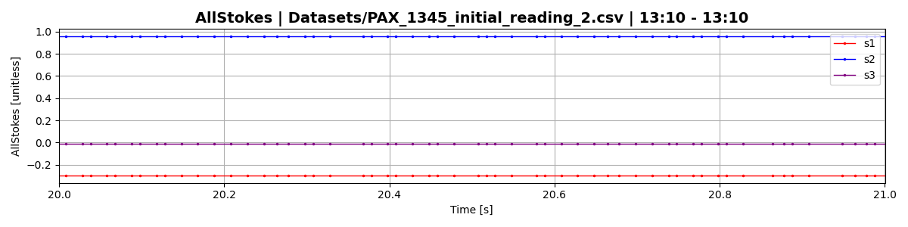

# Visualizing ThorLABS polarimeter measurement rate

## Introduction
The THORLABS PAX1000 digital polarimeter is a rotating wave plate based polarimeter with a nominal measurement rate up to 400 Hz when using a supplementary power supply. While many would like to use this product for precise and consistent measurement of time-varying polarization signals, the PAX1000 unfortunately fails expectations in both measurement rate and, more importantly, rate consistency.

Many applications like noise quantification and signal stability analysis benefit from evenly spaced points and high measurement rate. Below, I have written code to easily quantify and visualize the consistency of the PAX1000 measurement rate, which can be of use for anyone wanting to understand the distribution of time-spacing between subsequent measurements over a long dataset.
<!-- Include picture of PAX, sample dataset with varying rate consistency, and rate histogram. -->
<!--  -->

## Measurement rate instability
Ideally, the PAX1000 should take measurements evenly spaced in time - if the measurement rate is 20Hz, it should take a measurement every 0.05 seconds. Especially for higher measurement rates on the PAX (>80Hz), this "time difference between points" (TDBP) does not live up to expectations, and is furthermore widely varying throughout a given run, no matter the circumstances.

Below is an example of poor behavior in a typical dataset. A segment of the measurements themselves are shown in the upper plot, while the lower plot shows a log-scale histogram of the TDBP (time difference between points) for the entire run. On the histogram, I displayed the parameters used by the PAX, the resulting nominal measurement rate and TDBP, and the actual measurement rate and TDBP, as well as the standard deviation of the TDBP. The nominal TDBP, actual TDBP, and STD of the TDBP are all plotted in corresponding colors for easy viewing.

Note that
