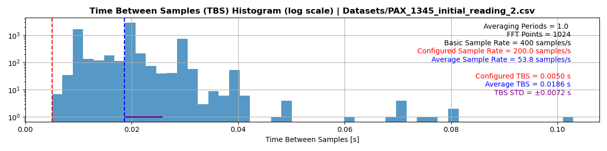
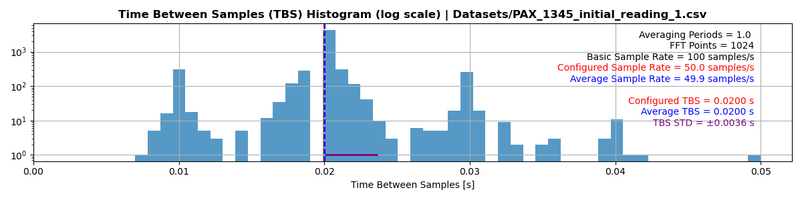

# Visualizing ThorLABS polarimeter measurement rate

## Introduction
The THORLABS PAX1000 digital polarimeter is a rotating wave plate polarimeter with a measurement rate of [400 samples/second](https://www.thorlabs.com/newgrouppage9.cfm?objectgroup_id=1564). In our experience, the measurement period is non-deterministic and sampled from a complex distribution function, crucial information for PAX users when parforming signal processing. This repository consists of tools to characterize the rate and variability in time between samples (TBS).

We report on measurements of the PAX1000IR2 with the following configuration.
* USBx interface
* Windows __ PC that meets the minimal hardware requirements detailed in the User Manual
* Thorlabs GUI and Drivers v 1.4
* Firmware Version (see .CSV datafile)
* external DS15 power supply
* 1345 nm laser light fiber-coupled to the PAX
** Single-mode laser with linewidth of ____
** 10 mW maximum power applied to PAX
* PAX alignment tool reports _% alignment

## Measurement rate variability
Salient configuration parameters are the Sample Rate and Operating Mode (including period and FFT points); see [PAX operation manual](https://www.thorlabs.com/thorproduct.cfm?partnumber=PAX1000IR2) for details. These are selected via the Thorlabs GUI. State of Polarization (SOP) data were acquired using the Thorlabs GUI and saved as .CSV. We get qualitatively similar results using a second PAX1000IR2 and different Windows PCs.

### Example and explanation

The above figure shows 1 second of time-domain SOP measurements; the quantities displayed are the normalized [Stokes parameters](https://en.wikipedia.org/wiki/Stokes_parameters). Note the irregular distribution in time between samples (TBS).

<!--  -->

The above figure shows the log-histogram of the TBS distribution, highlighting the variability in sample rate and rare but exceedingly long TBS ocurrences. This histogram utilizes the full 120 seconds of data from this run. PAX operating mode parameters (see [manual](https://www.thorlabs.com/thorproduct.cfm?partnumber=PAX1000IR2)) are printed in the upper right-hand corner. Also printed and plotted are the configured sample rate (red, dashed), and the mean (blue, dashed) and standard deviation (purple, solid) of the TBS distrubution.

### Other examples

## Code
These visualization tools can be interacted with in the [jupyter notebook](PAX_code/PAX_Code_Notebook.ipynb).

The Dataset class contains all relevant code for cleaning and visualizing the .csv file output from the PAX1000 software. Initializing a Dataset instance with the path to your file will automatically read in the data and relevant parameters from the run. A few example datasets including the ones displayed above are provided.

The method "Dataset.rate_hist()" will plot a histogram of the tdbp for the entire dataset; you can plot this histogram with a log-scale or linear-scale y-axis and with greater or fewer bins depending on the number of measurements you have access to. The method "Dataset.plot()" allows you to view the the measured parameters over the entirety or during any segment of the run. See the notebook for further details.

### Obtaining .csv file from PAX software
This code relies on the dataset comming from the PAX1000 software.

TODO: Pictures, guide for getting dataset

Keywords: PAX1000VIS, PAX1000IR1, PAX1000IR2, Thorlabs, rotating wave-plate polarimeter
